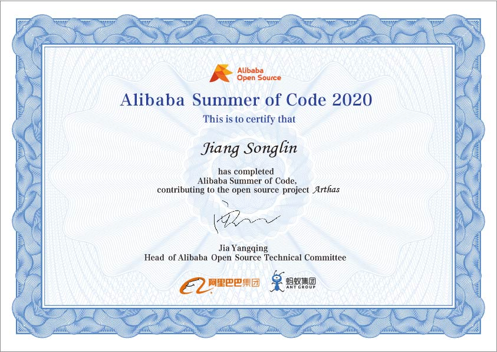

# 我的 阿里巴巴编程之夏

<object type="image/svg+xml" data="https://gh-card.dev/repos/alibaba/arthas.svg?link_target=_blank"></object>
## [2020 Final Result 结项](https://developer.aliyun.com/article/772801)

这里是我的"阿里巴巴编程之夏"活动记录与成果

|  年份   |  项目名称  |  项目议题  | 社区 |  入选名单  |  申请材料  |  项目仓库  | 项目记录 |
|  ----  | ----  |  ----  | ----  | ----  | ----  | ----  |  ----  |
| [2020](https://developer.aliyun.com/topic/summerofcode2020)  | Arthas在线教程重新编排，每个命令一个小教程 | [点此访问](https://github.com/alibaba/arthas/issues/847)  |[Arthas](https://github.com/alibaba/arthas/issues/1198)|[点此访问](https://developer.aliyun.com/article/767007?spm=a2c6h.14553213.J_1935739830.1.156922c1aWm0q8&groupCode=opensource) | [点此访问](2020-Arthas/Alibaba%20Summer%20of%20Code%202020%20Proposal.pdf) |[Arthas ASoC 2020](https://github.com/HollowMan6/Arthas-ASoC-2020)|[Wiki](https://github.com/HollowMan6/Arthas-ASoC-2020/wiki) |

[我的成果](https://arthas.aliyun.com/doc/arthas-tutorials.html?language=cn)

[微信推送](https://mp.weixin.qq.com/s/pMSYqXe-av6qflLirotBRA)

[2020总结](2020-Arthas/Conclusion-Chinese.md)

[2020结项报告](2020-Arthas/阿里巴巴编程之夏2020%20-%20Arthas结项报告.md)

[2020结项PDF版PPT](2020-Arthas/阿里巴巴编程之夏2020%20-%20Arthas结项报告.pdf)

[2020结项原版PPT](2020-Arthas/阿里巴巴编程之夏2020%20-%20Arthas结项报告.pptx)

[2020结项视频-Youtube](https://www.youtube.com/watch?v=hNbjZQopfCo&t=28s)

[2020结项视频-Bilibili](https://www.bilibili.com/video/BV1ih41197m3/)

# My Alibaba Summer of Code
This is my work and record under Alibaba Summer of Code.

|  Year   |  Project Name   | Project Issue  | Community |  Entering List  |  Application Material  | Project Repository  |  Project Log |
|  ----  | ----  |  ----  | ----  | ----  | ----  | ----  |  ----  | 
| [2020](https://www.alibabacloud.com/campaign/summerofcode2020)  | Provide a separate tutorial for each command | [Click here to visit](https://github.com/alibaba/arthas/issues/847)  |[Arthas](https://github.com/alibaba/arthas/issues/1198)|[Click here to visit](https://developer.aliyun.com/article/767007?spm=a2c6h.14553213.J_1935739830.1.156922c1aWm0q8&groupCode=opensource) | [Click here to visit](2020-Arthas/Alibaba%20Summer%20of%20Code%202020%20Proposal.pdf) |[Arthas ASoC 2020](https://github.com/HollowMan6/Arthas-ASoC-2020)| [Wiki](https://github.com/HollowMan6/Arthas-ASoC-2020/wiki) |

[My Result](https://arthas.aliyun.com/doc/arthas-tutorials.html?language=en)

[Wechat Post](https://mp.weixin.qq.com/s/pMSYqXe-av6qflLirotBRA)

[2020 Conclusion](2020-Arthas/Conclusion-English.md)

[2020 Final Report](2020-Arthas/Alibaba%20Summer%20of%20Code%202020%20-%20Arthas%20Final%20Report.md)

[2020 Final Report PPT in PDF](2020-Arthas/Alibaba%20Summer%20of%20Code%202020%20-%20Arthas%20Final%20Report.pdf)

[2020 Final Report Original PPT](2020-Arthas/Alibaba%20Summer%20of%20Code%202020%20-%20Arthas%20Final%20Report.pptx)

[2020 Final Report Video - Youtube](https://www.youtube.com/watch?v=kMy_NnYrc1A&t=17s)

[2020 Final Report Video - Bilibili](https://www.bilibili.com/video/BV1nT4y1L7gA/)
